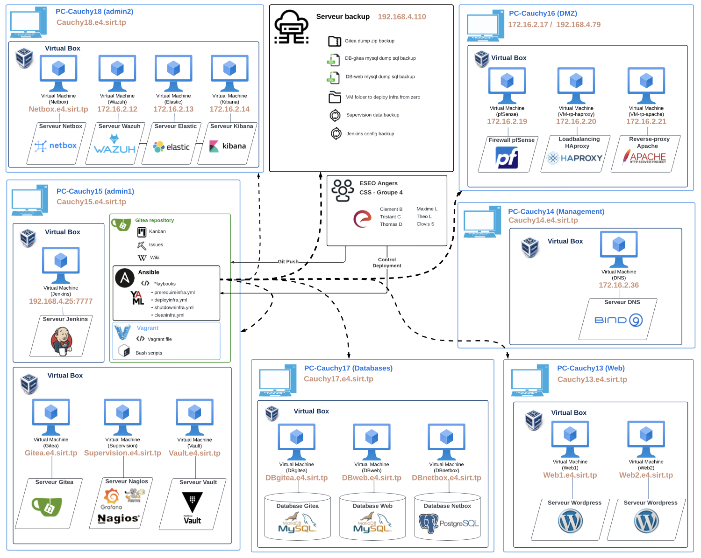

# Dépôt du Projet CSS Groupe 4 à l'ESEO - Semestre 8
 
Ce dépôt Git contient 4 playbooks Ansible pour gérer rapidement une infrastructure avec des machines virtuelles Vagrant. Les directory des machines virtuelles portent le nom ```"VM-nom-du-service"``` et sont réparties sur plusieurs adresses IP.

## Overview

<p align="center">
  
</p>  


## Prérequis

- [Git](https://git-scm.com/downloads) doit être installé sur la machine hôte.
- [VirtualBox](https://www.virtualbox.org/wiki/Downloads) doit être installé sur la machine hôte.
- [Vagrant](https://www.vagrantup.com/downloads) doit être installé sur la machine hôte.
- [Ansible](https://docs.ansible.com/ansible/latest/installation_guide/intro_installation.html) doit être installé sur la machine hôte.

## Déploiement de l'infrastructure via [Ansible](https://docs.ansible.com/ansible)

### **Prérequis**

Le playbook `Ansible/prerequireinfra.yml` permet de préparer le déploiement de l'infrastructure.

Il utilise les tâches suivantes :

- Récupération depuis le serveur sauvegarde des directory des VMs (rp-apache, rp-haproxy, vault, gitea, db-gitea)
- Déploiement de deux serveurs reverse-proxy (Apache & HAproxy) sur l'adresse **PC-pfSense 172.16.2.17**
- Déploiement d'un serveur coffre-fort Vault sur l'adresse **PC-admin Cauchy15.e4.sirt.tp**
- Partage des tokens du Vault aux VMs nécessitant un accès au serveur sauvegarde et aux mots de passes.
- Déploiement d'un serveur de base de données MySQL pour Gitea sur l'adresse **PC-db Cauchy17.e4.sirt.tp**
- Déploiement d'un serveur Gitea en local (**PC-admin Cauchy15.e4.sirt.tp**)

Pour préparer l'infrastructure, exécutez la commande suivante depuis la machine hôte (admin=**PC-admin Cauchy15.e4.sirt.tp**)  :

```bash
ansible-playbook prerequireinfra.yml
```

> **NOTE**
Pour l'incrément 3 de ce projet, nous estimons que les serveurs suivants (pfSense, DNS) sont déjà en service. 

### **Déploiement**

Le playbook `Ansible/deployinfra.yml` permet de déployer l'infrastructure.

Il utilise les tâches suivantes :

- Clonage du dépôt git S8-PCC4 sur le serveur hôte
- Mise en place depuis le PC hôte des directory des VMs (nagios, web, db-web)
- Déploiement d'un serveur Nagios en local (**PC-admin Cauchy15.e4.sirt.tp**)
- Déploiement d'un serveur de base de données MySQL pour Wordpress sur l'adresse **PC-db Cauchy17.e4.sirt.tp**
- Déploiement d'un serveur Wordpress sur l'adresse **PC-web Cauchy13.e4.sirt.tp**


> **NOTE**
Pour l'incrément 3 de ce projet, nous faisons un déploiement à partir de zéro, c'est-à-dire qu'on automatise la copie des directory de VM sur chaque PC hôte.

Pour déployer l'infrastructure, exécutez la commande suivante depuis la machine hôte (admin=**PC-admin Cauchy15.e4.sirt.tp**)  :

```bash
ansible-playbook deployinfra.yml
```

### **Update**

Le playbook `Ansible/updateinfra.yml` permet de mettre à jour rapidement toute l'infrastructure.

Il utilise les tâches suivantes :

- Lancement d'un script python pour mettre à jour les informations sur netbox.
- Restart de l'agent wazuh pour faire apparaître chaque agents sur wazuh.

Pour mettre à jour l'infrastructure, exécutez la commande suivante depuis la machine hôte (admin=**PC-admin Cauchy15.e4.sirt.tp**) :

```bash
ansible-playbook updateinfra.yml
```

### **Arrêt**

Le playbook `Ansible/shutdowninfra.yml` permet d'arrêter rapidement toute l'infrastructure.

Il utilise les tâches suivantes :

- Arrêt de toutes les VMs sur tous les serveurs hôte.

Pour arrêter l'infrastructure, exécutez la commande suivante depuis la machine hôte (admin=**PC-admin Cauchy15.e4.sirt.tp**) :

```bash
ansible-playbook shutdowninfra.yml
```

### **Nettoyage**

Le playbook `Ansible/cleaninfra.yml` permet de nettoyer rapidement toute l'infrastructure.

Il utilise les tâches suivantes :

- Suppression de tous les directory de VMs sur tous les serveurs hôte.

Pour nettoyer l'infrastructure, exécutez la commande suivante depuis la machine hôte (admin=**PC-admin Cauchy15.e4.sirt.tp**) :

```bash
ansible-playbook cleaninfra.yml
```

## Versions
 
**Dernière version stable :** 3.0  
**Dernière version :** 3.0  
Liste des versions : [Cliquer pour afficher](https://192.168.4.25/gitea/CSS4/S8-PCC4/releases)

## Auteurs

* **Clement Barbeau** _alias_ [@ClementB](https://192.168.4.25/gitea/clemba)

* **Tristan Caro** _alias_ [@TristanC](https://192.168.4.25/gitea/TristanC)

* **Thomas Dabout** _alias_ [@ThomasD](https://192.168.4.25/gitea/ThomasD)

* **Maxime Lelant** _alias_ [@MaximeL](https://192.168.4.25/gitea/MaximeL)

* **Théo Lurat** _alias_ [@TheoL](https://192.168.4.25/gitea/TheoL)

* **Clovis Souletis** _alias_ [@ClovisS](https://192.168.4.25/gitea/ClovisS)
