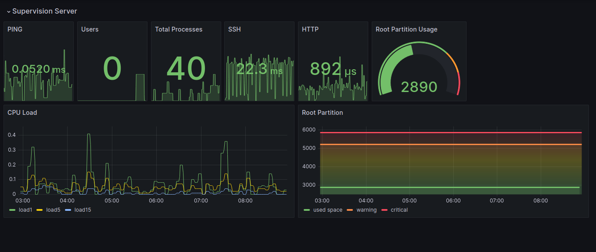
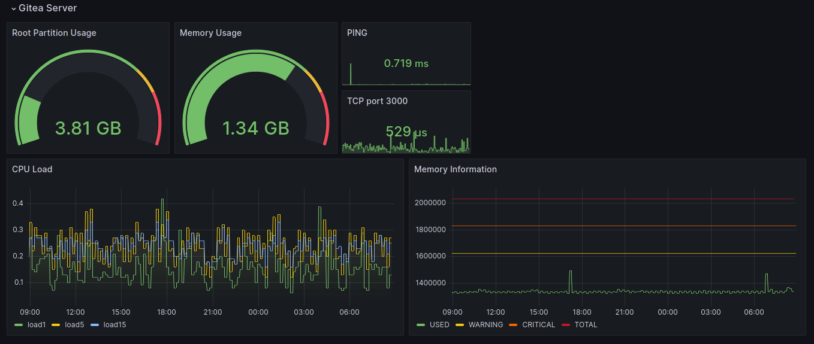
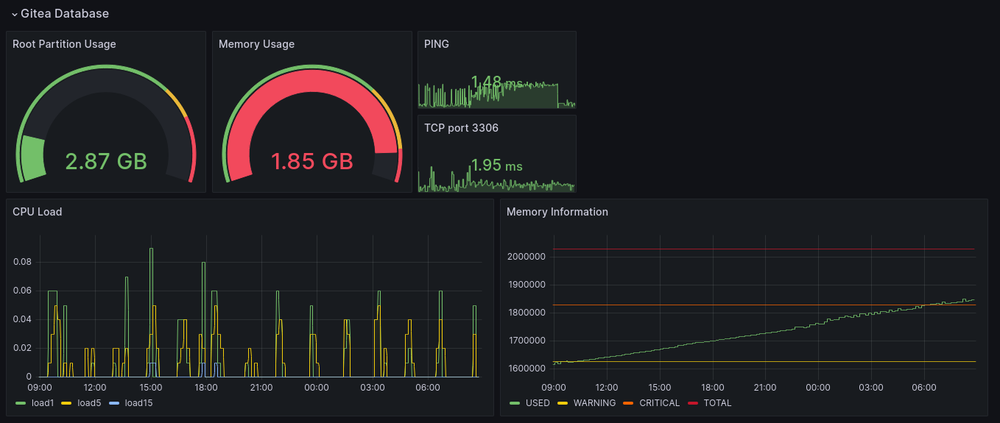
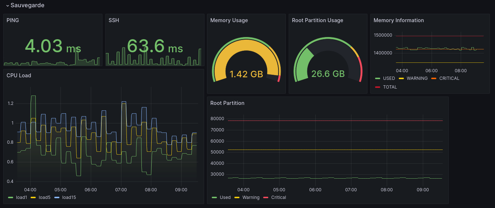
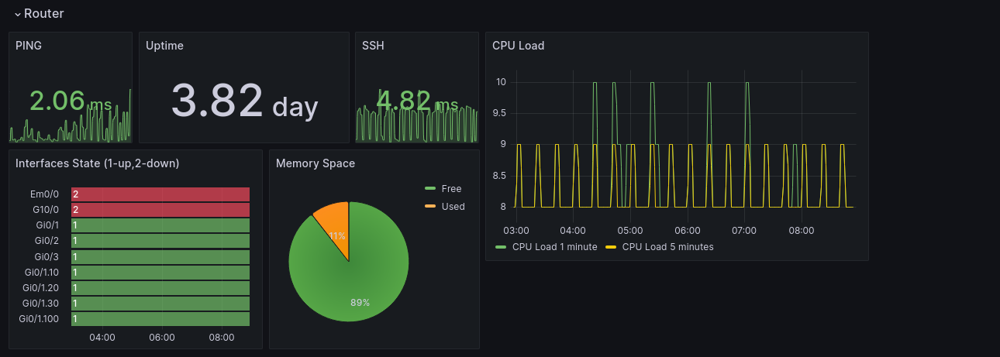
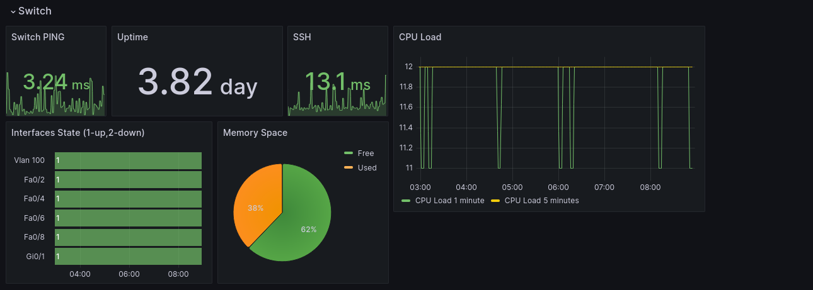

# Machine virtuelle hébergeant le serveur de Supervision

## Outils utilisés : Nagios, Grafana et Postfix
---
## Dashboards Grafana

#### Dashboard Supervision Server

  

#### Dashboard Gitea Server

  

#### Dashboard Gitea Database

  

#### Dashboard Network & Backup Server

  

#### Dashboard Router

  

#### Dashboard Switch

  

---

## Auteur

* **Clovis Souletis** _alias_ [@ClovisS](http://192.168.4.25/gitea/ClovisS)